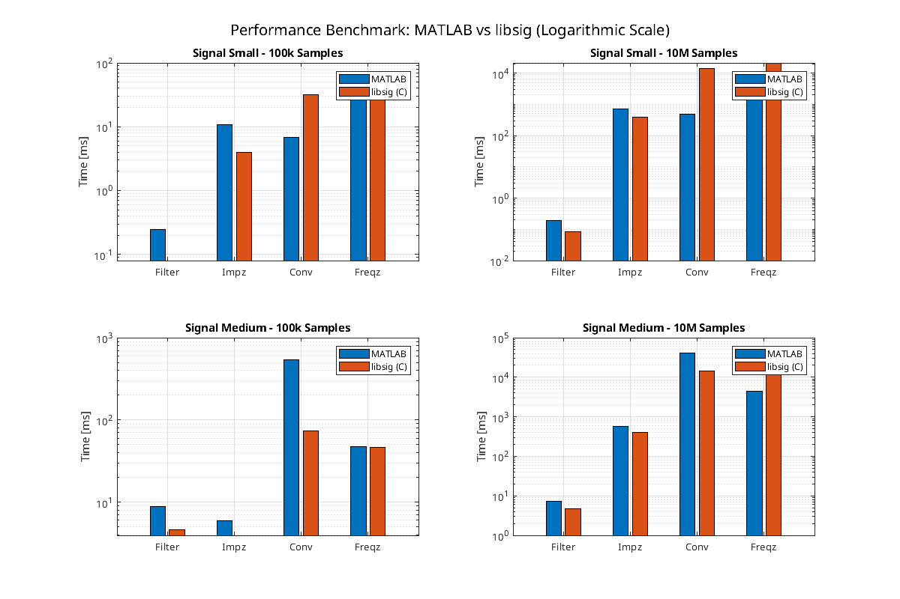

# libsig: DSP Function Implementations in C

## Introduction
This repository contains a C library implementing various digital signal processing (DSP) functions native to MATLAB. Developed as a school project, this library serves as an in-depth learning opportunity to explore algorithmic efficiency, memory management, and low-level optimization in C compared to high-level interpreted environments. 

## Project Structure
The repository is modularized into the following main directories:

* **`include/` & `src/`**: Contains the core library code. The header files define the API, while the source files provide multiple algorithmic implementations (naive, optimized, FFT-based, etc.) for each DSP function.
* **`app/`**: Holds the executable code responsible for I/O operations, configuring benchmarks, parsing data, and generating output results. 
* **`matlab/`**: Contains auxiliary MATLAB scripts. The first script generates standard test data. The second script runs MATLAB's native functions to establish a performance baseline, generates the expected target files (like filter coefficients) for the C application to check against, and logs execution times.

## How to Run

Follow these instructions to generate test data, establish MATLAB baselines, and run the C benchmarks locally.

1. **Clone the repository**: 
   ```bash
   git clone https://github.com/82ychitx/libsig
   ```
2. **Configure the C project**: Use CMake to configure the build. You can toggle between `Release` or `Debug` builds using the `-DCMAKE_BUILD_TYPE` flag. The `CMakeLists.txt` file is pre-configured with aggressive compiler flags in `Release` mode to maximize library performance.
3. **Generate test data**: Open the `matlab/` directory and run the data generation script. Modify the commented/uncommented lines inside the script to create `signal_small.csv`, `signal_medium.csv`, or `signal_large.csv` inside the `data/input/` directory.
4. **Run MATLAB benchmarks**: Execute the MATLAB benchmark script. It will prompt you for the input data file to use (e.g., `signal_small.csv`). You can manually modify parameters like filter rank, `impz` length, and `freqz` length within the script. Once finished, this will output MATLAB's execution times and generate the required `.csv` files (e.g., filter coefficients) for the C program.
5. **Build the C project**: Run CMake to compile the executable:
   ```bash
   cmake --build build
   ```
6. **Execute C benchmarks**: Run the compiled `libsig_bench` application. It will automatically load the inputs generated by MATLAB, process them using the provided algorithms, verify correctness, and output the timing results for each implementation.

---

## Benchmarks & Performance

### Test Environment
* **CPU**: Intel(R) Core(TM) i5-4200M CPU @ 2.50GHz
* **RAM**: 16GB
* **Parameters**: Filter rank of 50. Tests were executed using `signal_small` and `signal_medium` datasets with varying lengths for `impz` and `freqz`.



### Performance Nuances & Observations

**1. Measurement Methodologies**
It is important to note the difference in benchmarking methodology between the two languages. MATLAB's execution time measures the entire function call from start to finish. In the C benchmark, arrays were pre-allocated, and time was measured strictly around the algorithmic execution. MATLAB handles a lot of "pre-configuration" and overhead dynamically, which accounts for some of its slower speeds on small datasets.

**2. Floating Point Precision & Verification**
You will notice the C `libsig` results output a "Failed" status for algorithms when the filter rank increases. This is a byproduct of double-precision floating-point arithmetic. Minor rounding discrepancies accumulate across long loops compared to MATLAB's proprietary internal precision handling, causing strict equality checks against MATLAB's output to fail, despite the core logic being sound.

**3. The Multithreading (OpenMP) Overhead**
Multithreaded implementations (using OpenMP) frequently performed slower than single-threaded approaches in these benchmarks. Thread spawning overhead, context switching, and false sharing often outweigh the parallelization benefits unless operating on massive, highly divisible datasets. 

**4. Cache Access and FFT**
For large computations (e.g., medium signal with 10,000,000 frequencies for `freqz`), memory bottlenecking and CPU cache misses limit performance. In such cases, the FFT implementation drops in efficiency, yielding speeds near identical to the naive implementation due to suboptimal cache locality.

****5. Naive Benchmark Execution**
The benchmarks were executed naively as single runs for both the C application and the MATLAB script. There was no cache warmup (population) or averaging of multiple runs to smooth out outliers, meaning the results represent a raw, single-execution snapshot rather than a statistically robust profile.

### Results: Signal Small
*Note: Time measured in milliseconds [ms]. The C implementations listed are the most relevant optimized/FFT iterations.*

| Function / Setup | Filter (Form 1) | Impz (Optimized) | Conv (FFT Single) | Freqz (FFT) |
| :--- | :--- | :--- | :--- | :--- |
| **MATLAB (1k/1k)** | 0.218 | 0.517 | 0.329 | 1.239 |
| **libsig (1k/1k)** | 0.080 | 0.041 | 0.485 | 0.329 |
| **MATLAB (100k/100k)** | 0.246 | 10.731 | 6.834 | 47.201 |
| **libsig (100k/100k)** | 0.080 | 3.967 | 31.325 | 49.455 |
| **MATLAB (10M/10M)** | 0.196 | 710.258 | 489.864 | 4443.446 |
| **libsig (10M/10M)** | 0.084 | 392.028 | 13795.482 | 21230.282 |

### Results: Signal Medium (100,000 samples)

| Function / Setup | Filter (Form 1) | Impz (Optimized) | Conv (FFT Single) | Freqz (FFT) |
| :--- | :--- | :--- | :--- | :--- |
| **MATLAB (1k/1k)** | 10.069 | 0.369 | 4.875 | 1.139 |
| **libsig (1k/1k)** | 5.141 | 0.041 | 28.763 | 0.183 |
| **MATLAB (100k/100k)** | 8.838 | 5.913 | 537.304 | 47.121 |
| **libsig (100k/100k)** | 4.616 | 3.940 | 73.471 | 46.772 |
| **MATLAB (10M/10M)** | 7.176 | 566.866 | 40542.599 | 4512.007 |
| **libsig (10M/10M)** | 4.608 | 393.481 | 14639.145 | 22500.915 |

---

## Assembly Analysis and SIMD Optimization

When building the project in `Release` mode, the C compiler relies heavily on Single Instruction, Multiple Data (SIMD) instruction sets to optimize the loops. By reviewing the generated assembly file in the build directory, we can confirm the compiler successfully autovectorized the complex mathematics inside our FFT implementation.

The snippet below demonstrates AVX vectorization using `ymm` registers (which handle 256 bits of data simultaneously) instead of standard scalar registers:

```assembly
    vpermpd    $216, %ymm2, %ymm2    #, tmp545, vect_perm_odd_326
# /home/vojta/school/vut/first_year-25_26/summer/csi/libsig/src/libsig.c:934: double complex q = twiddle * y[bot_idx];
    vmulpd    %ymm7, %ymm1, %ymm8    # vect_perm_even_325, tmp531, vect__78.88
    vfmadd132pd    %ymm7, %ymm9, %ymm4    # vect_perm_even_325, vect_perm_even_315, _175
# /home/vojta/school/vut/first_year-25_26/summer/csi/libsig/src/libsig.c:936: y[top_idx] = p + q;
    vfnmadd231pd    %ymm2, %ymm1, %ymm4    # vect_perm_odd_326, tmp531, vect__7.91
    vfmadd132pd    %ymm2, %ymm9, %ymm1    # vect_perm_odd_326, vect_perm_even_315, _167
```

In the logic above, instructions like `vmulpd` (Vector Multiply Packed Double-Precision) and `vfmadd132pd` (Fused Multiply-Add) process multiple double-precision floats at once. The compiler has unrolled the FFT butterfly operations (`p + q` and `p - q`), drastically improving execution speed compared to unoptimized code.

***

